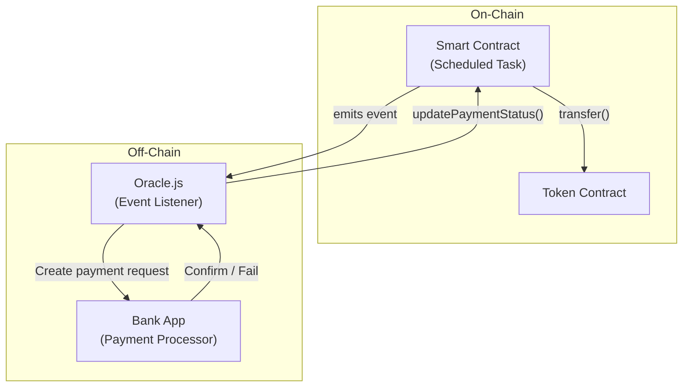
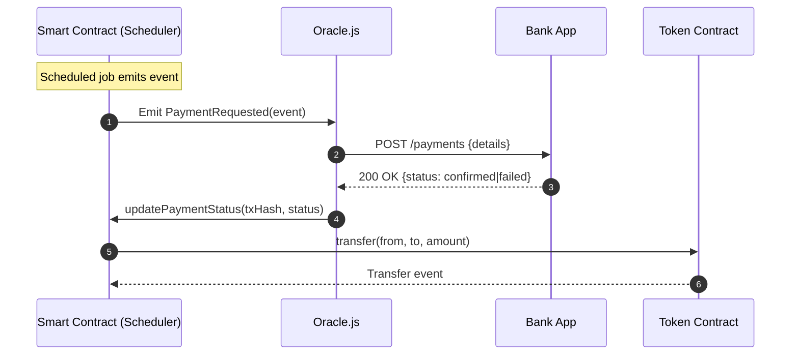

# 🧩 Mqube Demo Setup (Local Hardhat Environment)

This guide walks you through setting up the **Mqube Demo Environment** locally using **Hardhat** as a lightweight blockchain node.  
It explains how to deploy the Oracle smart contracts and connect the on-chain and off-chain components for end-to-end testing.

---

## 📚 Overview

There are **three repositories** used for this demo:

1. **[mqube-offchain-debit-transfer](https://github.com/spring-financial-group/mqube-offchain-debit-transfer)**  
   A simple "bank-style" off-chain application that processes payment requests sent by the Oracle WebSocket server (`Oracle.js`).

2. **[mqube-network-of-oracles](https://github.com/spring-financial-group/mqube-network-of-oracles)**  
   Contains the smart contracts that manage Oracle nodes and includes the **WebSocket server** (`Oracle.js`).  
   The Oracles listen for scheduled contract events and interact with the Bank App to execute payments.

3. **[mqube-onchain-debit-transfer](https://github.com/spring-financial-group/mqube-onchain-debit-transfer)**  
   Provides a web app and deployment scripts for Tokens and Smart Contracts (including those referencing Oracle addresses).  
   You can use either the Web App or CLI scripts to deploy and interact with the system.

---

## 🔗 Architecture Diagram

### High-Level Flow



### Event Sequence



---

## ⚙️ 1. Clone the repositories

Clone all three repositories into your workspace:

```bash
git clone https://github.com/spring-financial-group/mqube-offchain-debit-transfer.git
git clone https://github.com/spring-financial-group/mqube-network-of-oracles.git
git clone https://github.com/spring-financial-group/mqube-onchain-debit-transfer.git
```

---

## 🚀 2. Start the local Hardhat node

In the **network-of-oracles** directory, run:

```bash
npx hardhat node
```

This starts a local Hardhat node and generates several accounts with private keys and test ETH.

---

## 🧰 3. Prepare the environment

This repository does two things:

1. Builds a container to run the **Oracle.js WebSocket server**.
2. Packages the **Smart Contract ABIs** (compiled contract interfaces) so that JS scripts can listen for and interact with contract events.

Because we’re using a **local Hardhat node**, not a published chain, link the local ABI package:

```bash
npm link @spring-financial-group/contract-abis
```

Then create a symbolic link to make `localhost` point to the Hardhat deployment folder:

```bash
cd deployments
ln -s localhost hardhat
```

---

## 🏗️ 4. Deploy the Smart Contracts

Run the following commands:

```bash
npx hardhat clean
npx hardhat compile
npx hardhat run localhost
```

This deploys all contracts locally and prints output similar to:

```
DebitTransfer Contract address: 0x340E3e04b408F4DFb9D7994231Ab2b3E9beBc08f
```

> ⚠️ **Remember this Oracle address!**  
> Copy the `DebitTransfer Contract address` from the output — you’ll need it later.

```bash
# Save this value to reuse later
ORACLE_ADDRESS=0x340E3e04b408F4DFb9D7994231Ab2b3E9beBc08f
```

You’ll reference this variable below 👇  
[↑ Jump to where we set `ORACLE_ADDRESS`](#-4-deploy-the-smart-contracts)

---

## 🔌 5. Start the Oracle WebSocket Server

Run:

```bash
node Oracle.js
```

Expected output:

```
🔌 WebSocket server listening on port 8081
📡 Initializing contracts...
Health check server running on port 8080

🔍 Contract verification:
DebitTransfer Contract address: 0x340E3e04b408F4DFb9D7994231Ab2b3E9beBc08f
Has signer: true
Signer address: 0x5918b2e647464d4743601a865753e64C8059Dc4F
Signer balance: 1000000004.99 ETH
Is signer an owner on contract: true

✅ Contracts initialized
👂 Setting up event listeners...
✅ All systems ready!
```

---

## 🏦 6. Configure the Off-Chain App (Bank)

In the **OffChain Bank App (`mqube-offchain-debit-transfer`)**, edit the `.env` file:

```bash
cat .env
REACT_APP_NOTIFICATION_TIMEOUT="10000"
REACT_APP_WS_URL="ws://localhost:8089"
```

---

## 🔗 7. Configure the On-Chain App

In the **OnChain App (`mqube-onchain-debit-transfer`)**, you can use either the **Web App** or **CLI scripts**.

### Option 1: Web App

Edit `.env`:

```bash
cat .env
MQUBE_RPC_URL="http://127.0.0.1:8545/"
REACT_APP_DD_ORACLE_ADDRESS="0x340E3e04b408F4DFb9D7994231Ab2b3E9beBc08f"  # 👈 Use the Oracle address from above
```

Then start the Web App.  
If needed, import the deployed contracts into **MetaMask** using the local Hardhat node accounts.

---

### Option 2: CLI Script (Javascript)

Run the deployment script manually:

```bash
cd scripts
ORACLE_ADDRESS=$ORACLE_ADDRESS npx hardhat run working-test.js --network localhost
```

This script:
- Deploys the Token and DebitTransfer contracts
- Initializes them with the Oracle address
- Executes the full flow using two Hardhat test accounts

At the bottom of the script output, you’ll see a command like:

```bash
TOKEN_ADDRESS=0x998abeb3E57409262aE5b751f60747921B33613E \
CONTRACT_ADDRESS=0xDadd1125B8Df98A66Abd5EB302C0d9Ca5A061dC2 \
npx hardhat run trigger-payment.js --network localhost
```

> ⚠️ Use the actual addresses printed at the end of your deployment script — the above are examples.

### Option 3: CLI Script (GoLand)

Run it manually but use Go instead which shows you how to generate the Go code usign ABI as well 


https://github.com/spring-financial-group/go-onchain-approval

---

## ✅ Summary

You now have:
- A local Hardhat blockchain node running
- Oracle contracts deployed locally
- The Oracle.js WebSocket server listening for on-chain events
- The OffChain Bank App and OnChain App communicating end-to-end

---

## 🩺 Troubleshooting

- If contracts don’t appear in MetaMask, import them manually using the Hardhat node RPC URL.
- If `npm link` causes module resolution issues, reset with `npm unlink` and try again.
- Verify the Oracle.js console output to ensure it connects successfully to the local node and detects contract events.

---

## 🩺 You can set your local network up in Metamask following these steps:
1. Open Metamask and click on the network dropdown at the top.
2. Select "Add Network" or "Custom RPC" (the wording may vary depending on your Metamask version).
3. Fill in the network details as follows:
   - Network Name: Local Hardhat
   - New RPC URL: http://localhost:8545
   - Chain ID: 3151999

   And import the Accounts private keys to see the tokens change in the wallet ,although the script themselves will output them as well


